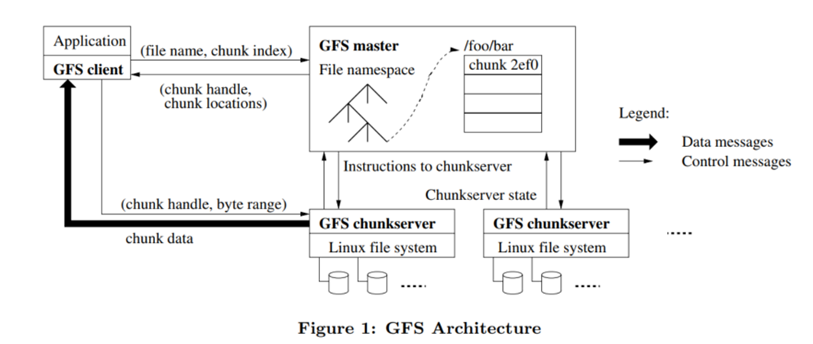
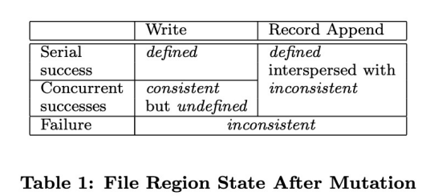
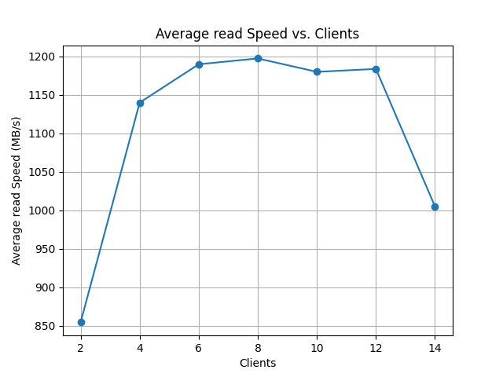
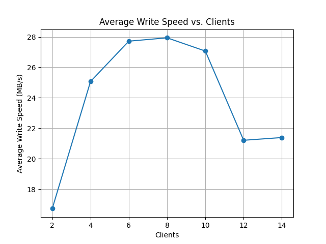
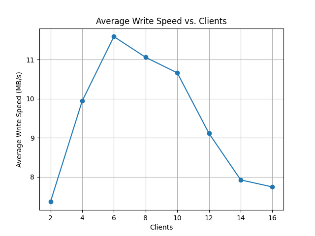

# GFS-Palhinia

This is an implementation of the Google File System(GFS) in golang, featuring the basic functions mentioned in the original GFS Paper

## About GFS

A scalable, fault-tolerant distributed file system.

- store chunks on local disks like Linux files
- read/write chunk data specified by a chunk handle and byte range
- consistency: see the picture below

## About the Implementation

In brief, we build the same architecture as well as the same consistency model as described in the original paper. And we provide POSIX APIs

And our overall structure is:

- Client
  - POSIX API
- Master
  - ChunkServerManager (information of CS)
  - ChunkManager (metadata of chunks)
  - NamespaceManager (metadata of files/file tree)
- ChunkServers
  - store the chunks
  - link to files

## Performance

Sadly, we can only test its performance under concurrent scenarios on a single machine. And here's the result:

|  |  |  |
|:---:|:---:|:---:|
| Read | Write | Append |

We can see that if the number of clients is at a low-level, the performance has significant gain as the number increases. However, it doesn't have scalability on a single home PC, which is quite obvious.

## Misc

Palhinha is a monster tackler, the kind of which has to be seen to be believed. His youth coaches in Portugal were staggered at how he would tirelessly fly into challenge after challenge when most young footballers wanted to develop into flair players or goalscorers. All that practice from a young age has paid off. Palhinha made the most tackles of any player in the English Premier League last season by a huge margin - 152, which was 24 more than closest challenger João Gomes of Wolverhampton Wanderers.

